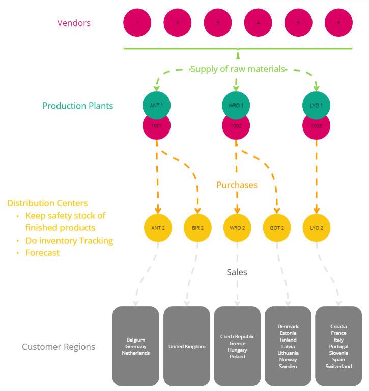

# SunCharge
SunCharge specializes in manufacturing eco-friendly car batteries for electric vehicles and home batteries. Ensuring the smooth operation of our production process and timely delivery of our products to customers is paramount. Our dedicated team of data analysts provides forecasts based on sales projections, enabling us to anticipate the demand for batteries in the coming months. This insight allows us to strategically plan our production schedules to meet customer demands. Additionally, we track inventory levels of our finished products to ensure optimal stock availability. 

We seek your assistance in developing an intuitive monitoring system to detect supply chain issues and identify areas for improvement. By leveraging your services, we aim to make informed decisions that optimize our logistics operations effectively.

## Supply Chain
Outlined below is an illustrative depiction of our supply chain infrastructure. Our company contains three production plants and five distribution centers. Our finished products are manufactured within our production plants and transported to our distribution centers, responsible for the distribution among our customers. Every distribution center covers a specific area. Our production plants have a dedicated area to temporarily store our finished products (vendors 1001, 1002, and 1003). Our six external vendors cover the supply of our raw materials.

## Data Description
#### BOM
The build of materials lists the materials we use to build our finished products.
#### Materials
1. MaterialKey: Unique identifier for each material.
2. MaterialType: Distinguishes between Finished Products and Semi-Finished Products.
3. MaterialDescription, Product Category, Component: Provide detailed descriptions and categorizations of the materials.
#### Plants
1. PlantKey: Unique identifier for each plant.
2. Plant, PlantType: Distinguish between Production plants and Distribution Centers.
3. PlantName, PlantCity, PlantPostalCode, PlantStreet: Provide location and naming details of the plants.
#### Vendors
1. VendorKey: A unique identifier for each vendor.
2. VendorTier: Indicates the tier or level of the vendor. T0 vendors are directly associated with the company's production facilities. T1 vendors represent suppliers of materials or components.
3. VendorName and VendorLocation (Country, City, Postal Code, Street): Provide specific details about each vendor’s location.
#### Purchases
Ordered finished products by our distribution centers to meet sales requirements.
1.	Vendor Shipment Date: This is the date when the vendor or supplier ships the goods. 
2.	Arrival Date Yard: This is the scheduled date when the shipment is expected to arrive at a specific yard or storage facility within the supply chain network.
3.	Goods Receipt Date: The goods are received at their final destination or point of delivery.
#### Inventory
A list of the finished products that are available in our plants.
1.	Gross Inventory Quantity: This represents the total quantity of a particular item in inventory, including all available stock, regardless of its condition or location.
2.	On-Shelf Inventory Quantity: This refers to the quantity of inventory that is physically present and available for sale or use on shelves or storage locations within a facility or retail store.
3.	In-Transit Quantity: This represents the quantity of inventory in transit between locations within the supply chain.
#### Forecast
Expected sales for the upcoming months.
#### Material Plant Relation
Materials are supplied or produced by vendors and then sent to the plants for further processing, storage, or distribution. The data contains both internal (TO vendors) and external (T1 vendors) flow of materials.
1. MaterialKey and PlantKey: Reference keys from the Materials and Plants datasets, establishing a connection between specific materials and plants.
2. MaterialPlantKey: A unique identifier for each Material-Plant relationship.
3. VendorKey, StandardCost, Currency: Vendor information and cost details related to the material at a specific plant.
4. Production Time: This refers to the duration it takes to produce goods or materials from the initiation of manufacturing processes to the completion of production.
5. Inbound Transportation Time: This represents the time taken for transporting goods or materials from the supplier or manufacturer's location to the receiving location.
6. Goods Receipt Processing Time: This is the time taken to process goods upon arrival at the receiving location.
7. Total Inbound Time: The total time spent in production, inbound transportation, and goods receipt processing. It provides an overall view of the duration from initiating production to completing goods receipt processing, encompassing all relevant stages of the inbound logistics process.

